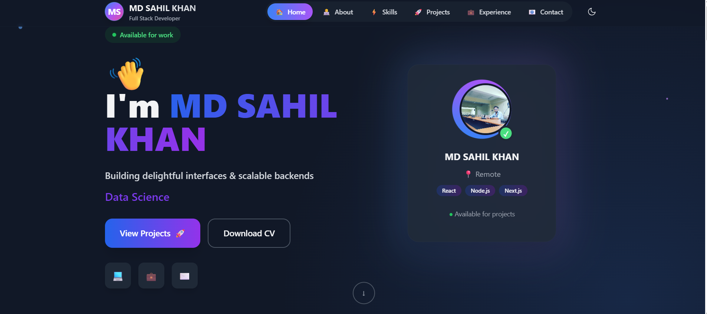
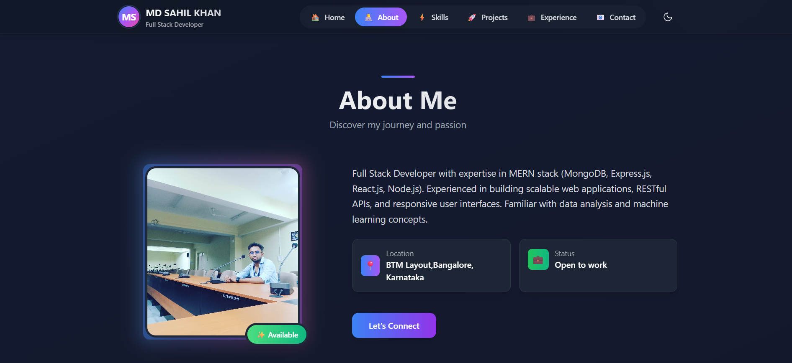
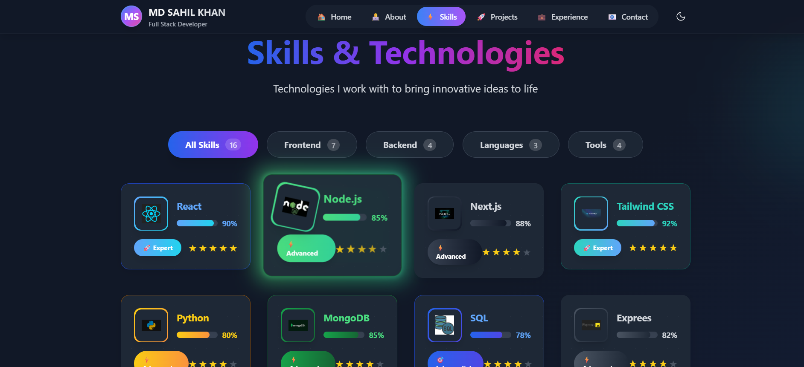
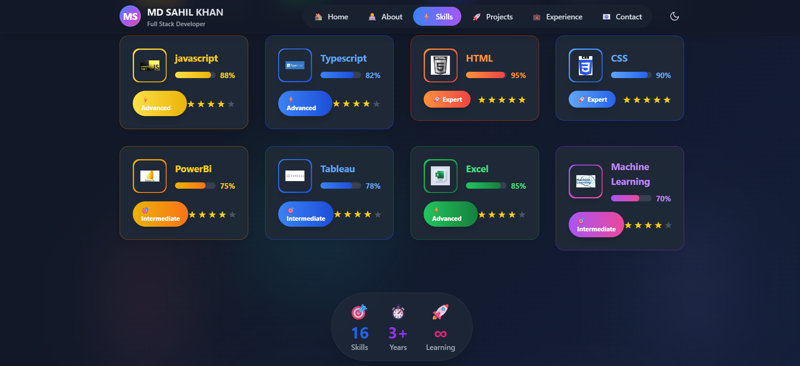
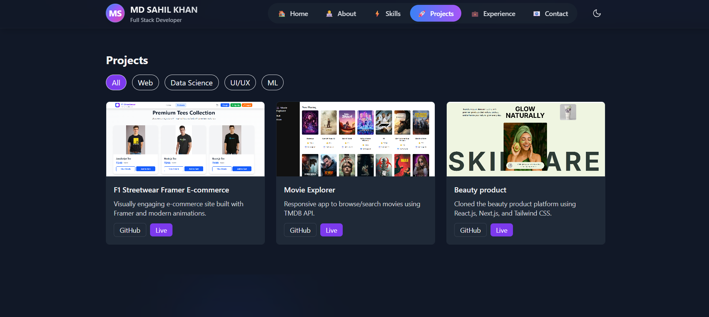
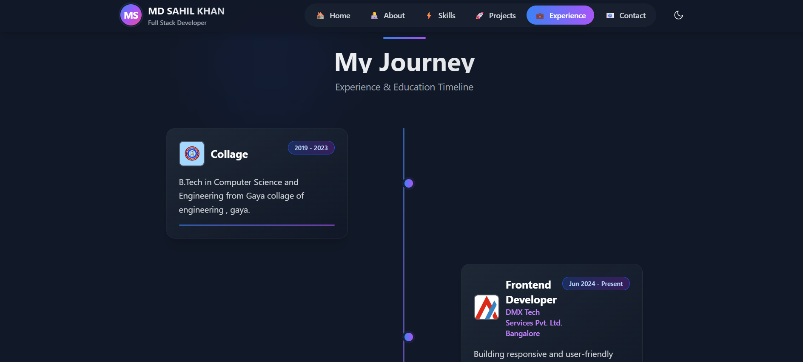
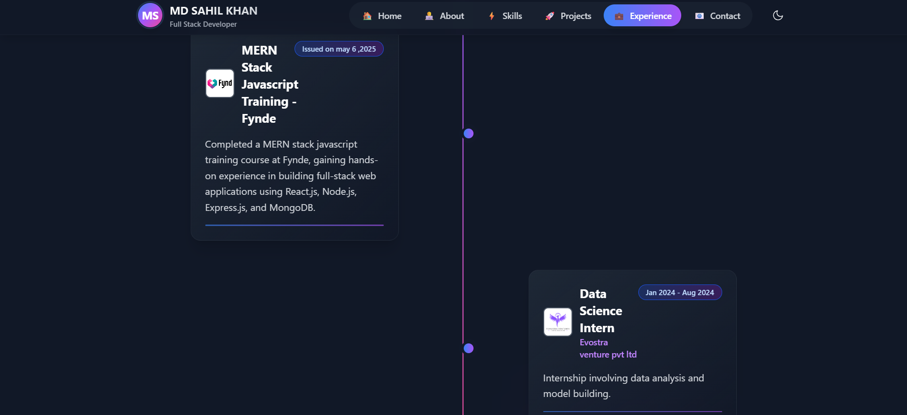
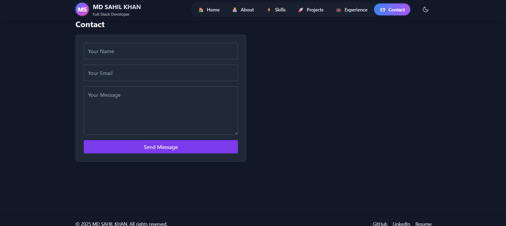

# 🌐 My Portfolio – MD SAHIL KHAN
### 🏠 Home Page

## if you want to see magic  on my portfolio then click to dard mode icon 


Welcome to my personal portfolio website 🚀  
This portfolio showcases my **skills, projects, and experience** as a **Frontend Developer | MERN Stack Developer | Data Science Enthusiast**.  
It is built with **modern technologies** and follows the latest **UI/UX design trends (2024–2025)**.

---

## 👨‍💻 About Me
- 💼 **Profession:** Frontend Developer | MERN Stack | Data Science Enthusiast  
- 📍 Based in BTM Layout Banglore , India  
- 🎓 B.Tech in Computer Science (Gaya College of Engineering)  
- 📚 Certifications: CCNA, PCAP: Programming Essentials in Python  
- 🌱 Currently exploring **React.js, MERN stack projects, and Data Science applications**

---

## 🚀 Features of Portfolio
- ⚡ Built with **React (Vite) + TailwindCSS + Framer Motion**
- 🌓 **Dark/Light mode toggle**
- 🎬 Smooth animations & transitions
- 👨‍💻 **Dynamic Projects Section** (filterable categories)
- 📄 **Resume Download** option
- 📬 **Contact Form** with EmailJS integration
- 📱 Fully **responsive design** (desktop, tablet, mobile)

---

## 🛠️ Tech Stack
- **Frontend:** React, Vite, Tailwind CSS, Framer Motion  
- **Backend (Projects):** Node.js, Django, Flask  
- **Database:** MongoDB, MySQL  
- **Other Tools:** Git, GitHub, VS Code, EmailJS  

---

## 📂 Project Structure

portfolio/
├─ public/
│ ├─ favicon.ico
│ └─ resume.pdf
├─ src/
│ ├─ assets/ # images, icons
│ ├─ components/ # reusable React components
│ ├─ data/ # siteContent.js (bio, skills, projects, etc.)
│ ├─ hooks/ # custom hooks
│ ├─ pages/ # main pages
│ ├─ styles/ # global Tailwind + custom styles
│ ├─ utils/ # animations, helpers
│ ├─ App.jsx
│ └─ main.jsx
---

## 📸 Screenshots










 

---

## ⚡ Getting Started (Local Setup)

Clone the repo and run locally:

```bash
# Clone repository
git clone https://github.com/mdsahilkhan2001/My-Portfolio

cd My-portfolio

# Install dependencies
npm install

# Run development server
npm run dev


📬 Contact
📧 Email: mdsahilkhan2001@gmail.com

🔗 LinkedIn: linkedin.com/in/sahilkhanq1

💻 GitHub: github.com/mdsahilkhan2001
